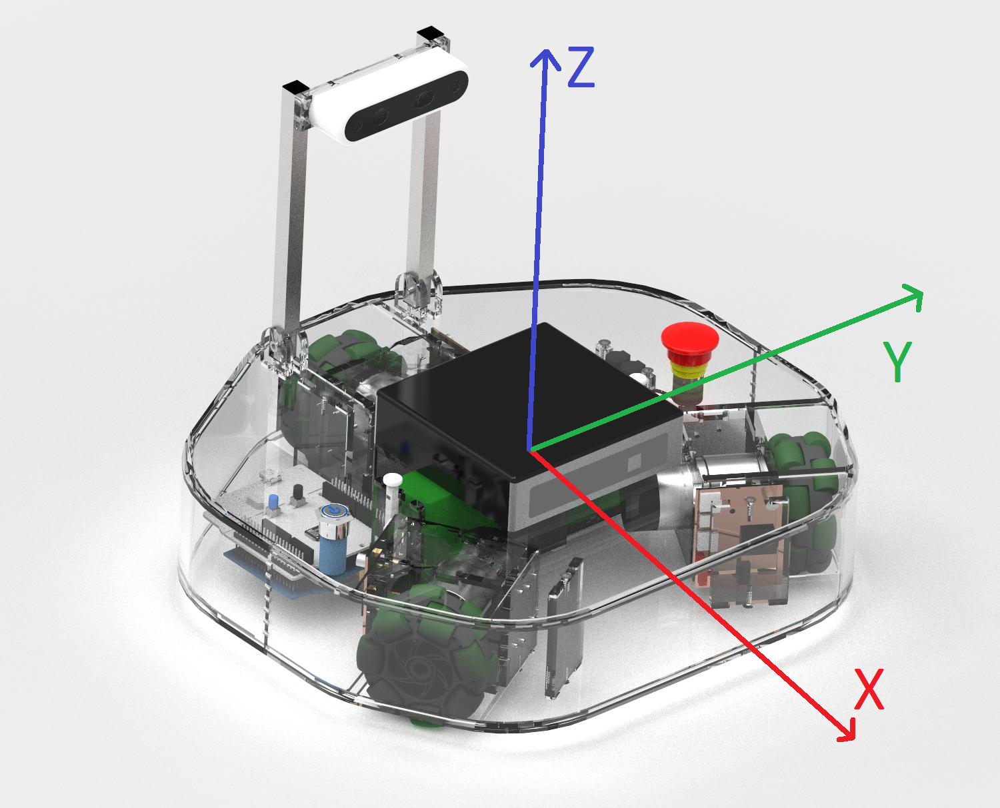

Programmeerime ROS roboti sõitma
================================

.. Giti üles seadmine
.. ------------------------
.. 
.. Git on versioonihaldustarkvara, mis aitab meil salvestada koodi internetti, et seda ka hiljem kasutada saaks, kui arvutist kood kustutatud on.
.. 
.. 1.  Mine lehele https://github.com/ ning registreeri ennast kasutajaks.
.. 2.  Logi sisse
.. 3.  Mine lehele https://github.com/ut-ims-robotics/robotont_blank_scripts
.. 4.  Vajuta paremal üleval nuppu “Fork”, see kopeerib selle repositooriumi sinu kasutajasse.
.. 5.  Vajuta rohelist nuppu “Clone or download”
.. 6.  Kopeeri sealt aadress
.. 7.  Ava terminal ning trüki sinna
.. 
..     **cd catkin\_ws/src**
.. 
.. 8.  Seejärel sisesta
.. 
..     **git clone \-sinu\-kopeeritud\-link\-**
.. 
.. 9.  Nüüd trüki terminali
.. 
..     **catkin build**
.. 
.. 10. Kui see protsess on lõpetanud edukalt, sulge terminal ja oled valmis praktikumiga jätkama.

Sissejuhatus
-------------------

Selles sektsioonis kirjutame programmi, mis paneb roboti sõitma. ROSis on enamasti kasutusel programmeerimiskeeled C++ ja Python. Meie valik on Python, sest see on lihtsam ja sobib paremini programmeerimisega alustamiseks. Pythoniga tutvumisel on abiks Tartu Ülikooli arvutiteaduste instituudi `programmeerimisõpik <https://progeopik.cs.ut.ee/index.html>`_.

.. Selles praktikumis kasutame roboti liigutamiseks for-tsükleid ning funktsioone.

ROS-rubriigid
---------------------

ROSis töötavad samal ajal erinevad sõlmed. Sõlmed on programmid, mis täidavad ROSis mingit konkreetset ülesannet. Näiteks võib üks sõlm suhelda kaameraga ja saata sealt pilti, teine sõlm liigutada soovitud suunas roboti rattad, kolmanda sõlme abil juhtida robotit klaviatuuri abil jne. 

Selleks, et kogu robot ühtsena töötaks, peavad sõlmed omavahel suhtlema. Näiteks sõlm, mis paneb rattad liikuma, peab teadma kuhu suunas rattad liikuma panna ning see informatsioon tuleb sõlmelt, kus saad klaviatuuriga robotit juhtida.
Suhtlemiseks on ROSis kasutusel ROS-rubriigid. 
Rubriigil on oma nimi ning sõlmed saavad sinna sõnumeid kuulutada ning sealt tellida. 
Roboti kiiruse määramiseks on ROSis kujunenud standard rubriik nimega “cmd_vel” (*velocity command*). Sinna rubriiki saab kuulutada sõnumeid, mis määravad kuhu poole robot liikuma peaks. Samaaegselt tellib sellest rubriigist sõnumeid rattaid juhtiv sõlm, mis edastab saabunud kiirused juba rattaid kontrollivale juhtelektroonikale.

Rubriik *cmd_vel*
---------------------------------------

Selleks, et robot liikuma hakkaks, peame sellele edastama info, kui kiiresti ja mis suunas liikuda. 
Selleks on meile muutmiseks saadaval kolm argumenti: x-suunaline kiirus, y-suunaline kiirus ja z-telje ümber pöörlemiskiirus. 

            ..

Positiivsed x’i väärtused panevad roboti edasi sõitma, negatiivsed tagurpidi.
Positiivsed y’i väärtused panevad roboti vasakule sõitma, negatiivsed paremale.
Positiivsed z’i väärtused panevad roboti vastupäeva pöörlema, negatiivsed päripäeva.
x ja y väärtused on ühikutes *m/s*, seega hoia need alla ühe.

Etteantud näidiskoodis on võimalus muuta kõiki kolme argumenti. 
Esimene eesmärk on aru saada, kuidas need töötavad, et oskaks hiljem neid kasutada ka keerukamatel juhtudel.
Leia koodis see koht ning muutes x, y ja z väärtusi, lahenda järgnevad ülesanded.

.. code-block:: python

    vel_msg.linear.x = 0
    vel_msg.linear.y = 0
    vel_msg.angular.z = 0
    velocity_publisher.publish(vel_msg)
    rospy.sleep(0.1)

Näiteülesanne
-------------

.. ja tee ssh-ühendus robotisse
.. .. toggle-header::
..     :header: **Kui töötad simulatsioonis**

..         Kui töötad simulatsioonis, siis ava lihtsalt terminal.

.. 2.  Trüki terminali

1.  Ava terminal ja sisesta käsk

.. code-block:: bash

  nano catkin_ws/src/ros_koolitus/scripts/move.py

See avab Python’i faili, kus hakkame väärtusi muutma. 

2.  Failis on muudatuste tegemiseks eraldi ala, mis on ümbritsetud ridadega :code:`YOUR CODE HERE START` ja :code:`YOUR CODE HERE END`. 

    .. figure:: ../images/lab02/yourcodehere.png
                :scale: 70 %

                ..
3. Määra *vel_msg.linear.x* väärtuseks 0.2.

4. Salvesta ning välju.

Programmi käitamine simulaatoris
--------------------------------

Tarkvara arendamisel tekib tihtipeale vigu, mis näiteks suurte tööstusrobotite puhul võivad põhjustada pöördumatut kahju nii robotile endale, ümbritsevatele objektidele kui ka roboti operaatorile. Selle vältimiseks on enne programmi käivitamist päris robotil alati kasulik seda põhjalikult testida simulaatoris. ROSi simulatsioonikeskkonnaks on Gazebo. Gazebo võimaldab luua virtuaalse maailma, paigutada sinna robot, ja simuleerida toimuvat.
Gazebo käitamiseks ava uus terminali aken ning sisesta käsk:

.. code-block:: bash

  roslaunch robotont_description gazebo.launch

1.  Nüüd otsi uuesti üles eelmine terminal ja käivita seal oma muudatustega programm:

.. code-block:: bash

  rosrun robotont_koolitus move.py

.. note:: Peatamiseks vajuta samas terminalis korraga klahve **Ctrl + C**.

2.  Kui robot sõitis otse, siis jätka, kui ei sõitnud, siis mõtle, mis võis minna valesti ja vajadusel küsi abi juhendajalt.

Programmi käitamine robotil
---------------------------

Kui simulaatoris sõidab robot nagu soovitud, on aeg proovida sõitmist päris roboti peal. 

1.  Sulge Gazebo, selleks leia terminal, kust Gazebo käivitasid ja vajuta **CTRL + C**

2.  Kasutades sama terminali, loo ssh-ühendus robotisse.

2.  Uues terminalis, mis on ühenduses robotiga sisesta:

.. code-block:: bash

    roslaunch robotont_teleop teleop_bare.launch

See paneb käima ROSi roboti draiveri sõlme, mis kontrollib rataste kiirusi vastavalt meie saadetud sõnumitele.

Kuna nüüd on ROSis peremeheks (*ROS Master*) robot, siis on vaja sellest kuidagi sülearvuti ROS sõlmedele teada anda. Selleks sisesta sülearvutiga ühenduses olevas terminalis käsk kujul:

.. code-block:: bash

    export ROS_MASTER_URI=http://192.168.200.X:11311

kus :code:`X` asenda oma roboti numbriga.

3.  Seejärel käivita seal oma muudatustega programm täpselt nii nagu simulatsiooni puhul.

.. code-block:: bash

   rosrun robotont_koolitus move.py

.. note:: Peatamiseks vajuta samas terminalis korraga klahve **Ctrl + C**.

Nüüd, kui tutvus on tehtud, proovi lahendada järgmised väljakutsed. **Iga ülesande järel kirjuta üles kasutatud x, y ja z väärtused**.

    a.  Pane robot sõitma tagasi.
    b.  Pane robot sõitma vasakule/paremale.
    c.  Pane robot pöörama vasakule/paremale.
    d.  Pane robot sõitma 45 kraadise nurga all.
    e.  Pane robot kaares sõitma.
    f.  Pane robot ringis sõitma.

